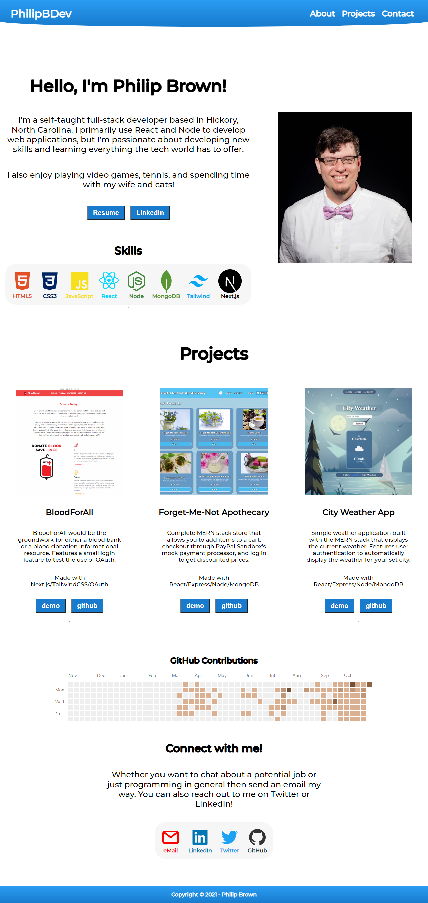

  <h3 align="center">Philip Brown's Portfolio</h3>

  

     
    <a href="https://www.philipb.dev">View Demo</a>
    ·
    <a href="https://github.com/PhilipBDev/Portfolio/issues">Report Bug</a>
    ·
    <a href="https://github.com/PhilipBDev/Portfolio/issues">Request Feature</a>
    

  

<!-- TABLE OF CONTENTS -->

  
<h2 style="display: inline-block">Table of Contents</h2>

  <ol>
    <li>
      <a href="#about-the-project">About The Project</a>
      <ul>
        <li><a href="#built-with">Built With</a></li>
      </ul>
    </li>
    <li><a href="#roadmap">Roadmap</a></li>
    <li><a href="#license">License</a></li>
    <li><a href="#contact">Contact</a></li>
    <li><a href="#resources">Resources</a></li>
  </ol>

<!-- ABOUT THE PROJECT -->

## About The Project

This is the repository for my portfolio website. I've created it with Gatsby, various plugins, and Styled-Components.

### Built With

- [Gatsby](https://www.gatsbyjs.com/)
- [Styled-Components](https://styled-components.com/)

<!-- ROADMAP -->

## Roadmap

See the [open issues](https://github.com/PhilipBDev/Portfolio/issues) for a list of proposed features (and known issues).

<!-- LICENSE -->

## License

Distributed under the MIT License. See `LICENSE` for more information.

<!-- CONTACT -->

## Contact

Your Name - [@PhilipBDev](https://twitter.com/PhilipBDev) - PhilipBDev@gmail.com

Project Link: [https://github.com/PhilipBDev/Portfolio](https://github.com/PhilipBDev/Portfolio)

<!-- RESOURCES -->

## Resources

- [Netlify](https://www.netlify.com/)
- [Namecheap](https://www.namecheap.com/)
